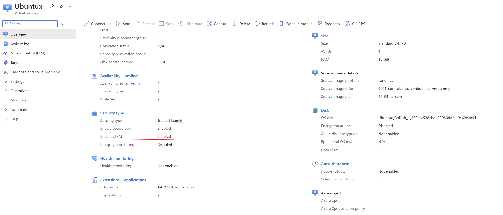

# HackAI- Hackathon

## Prerequisites

Before running this project, make sure you have the following installed:

- **NVIDIA AI Workbench**: [Installation guide](https://docs.nvidia.com/ai-workbench/user-guide/latest/installation/overview.html)
- **Python 3.8+**
- **CUDA Toolkit** (for GPU acceleration)
- **Docker** (for containerized environments)


## Installation 

1. **Set Up NVIDIA AI Workbench**:
    - Follow the [Installation guide](https://docs.nvidia.com/ai-workbench/user-guide/latest/installation/overview.html) to set up the Workbench on your local machine or cloud environment.
    
    - Start the local server in Nvidia AI Workbench
   
   

    - Start new project, where you can clone the new repository from github.
    

2. **Clone the Repository in the new project**:
    ```bash
    git clone https://github.com/W2SG-smokiee/nvidia_ai.git
    cd nvidia-ai 
    ```
    - After cloning the repository the project should be in a build-ready stage which you can see at the bottom right corner of the AI workbench.
   

3. **Launching NVIDIA Workbench using WSL**

- To start the NVIDIA Workbench environment on WSL, use the following command:

```bash
wsl -d NVIDIA-Workbench --cd ~
```


4. **Activate the NVIDIA Workbench Environment**:
   Use the following command to activate the local environment:
   ```bash
   nvwb activate local && nvwb open Synthetic AI Data generator
   ```


3. **Install Dependencies and Configure environment variables**:
    ```bash
    pip install -r requirements.txt
    ```

4. **Run the application on CLI**
    ```bash
    ```


- [Implementation of DCR](./data_clean_room/dcr_implementation.md)
---
### Overview 

Highlighting the main theme of this event  of utilizing Generative AI to empower “Data Collaboration Intelligence”. We developed a data sharing platform that allows private data sharing, predictive analytics and model building among different data parties, in essence, the “Data Clean Room” to enhance Click-through Rate (CTR) predictions using privacy-preserving synthetic data.

In both of the Parts, i.e., Implementation and Evaluation, we used various technologies including Azure Confidential Cloud VM, imbibing TDVM was well as TEE (Trusted Execution Environments),specifically Intel® TDX and SGX, GAN neural network, Gen AI, and Machine Learning Models. Similarly, several concepts like Hashing, Trusted Computing, Synthetic Data Fidelity and Synthetic Data Utility, Verification of Quote and Return Key.

---

## Data Clean Room Overview

Our secure Data Clean Room (DCR) uses Microsoft Azure Confidential VMs (Cloud VM) for enhanced data protection. These C VMs utilize Trusted Execution Environment (TEE) technology, specifically Intel® TDX and SGX , to create a secure enclave for processing data and cryptographically isolate and protect your data confidentiality and integrity.
These C VM’s have virtual Trusted Platform Modules (vTPM) built-in, and also combining the use tpm2-tools we can setup enables Remote Attestation ( which creates the keys),required for verifying that the environment is trustable.
For additional security, our programs are containerized using Docker. Containerization isolates applications from the underlying system and other applications, minimizing potential vulnerabilities.
While this approach focuses on data-in-use security, we acknowledge the importance of protecting data at rest and in transit. To achieve this, we plan to implement Azure storage encryption for data at rest and secure transfer protocols like FTPS for data transfers



| |  |
|:-------------------------------------------:|:-------------------------------------------:|

---

## Data Evaluation

We aim to derive insights about potential customers by analyzing various aspects of user behavior and demographics. The following insights can help ad agencies better understand their potential customers and refine their advertising strategies to increase engagement and conversion rates.
We aimed to train a predictive model with the following parameters - Identifying Potential Customers, Incorporating Diverse Attributes, Probability Prediction. which utilizes a comprehensive set of attributes, including audience demographics, news content attributes, advertisement attributes, and device attributes, to enhance the prediction accuracy and predicts the probability that a given audience member will become a potential customer based on the aforementioned attributes, enabling more targeted and effective advertising strategies.

| | |
|:-------------------------------------------:|:-------------------------------------------:|
| | |
|  | |
| | |
| | |

---

## Workflow

(./Screenshot_2024-10-01_150118.png)

 Team Name: Freemasons

Team Leader: Arnav Sonavane

Members:
- Prisha M
- Dhanush 
- Shiva Sukumar
